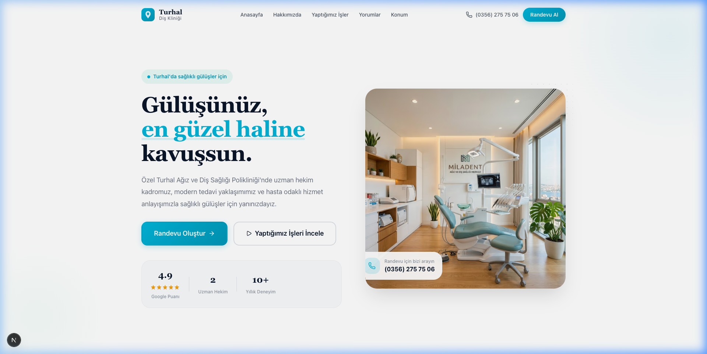
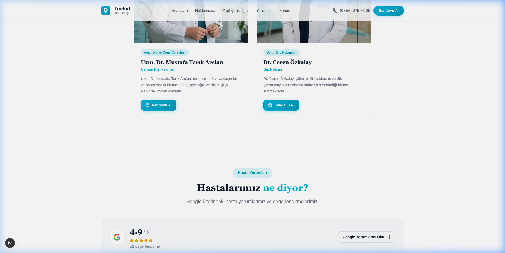
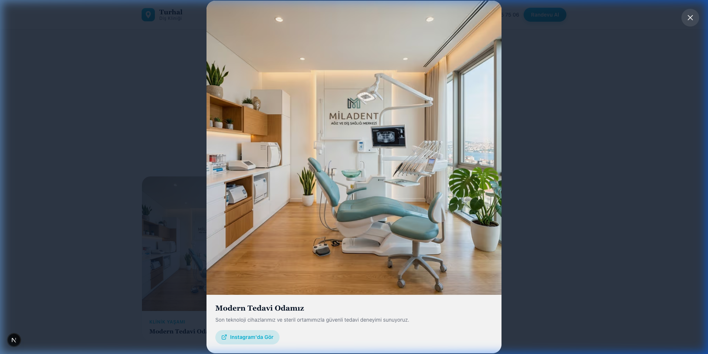
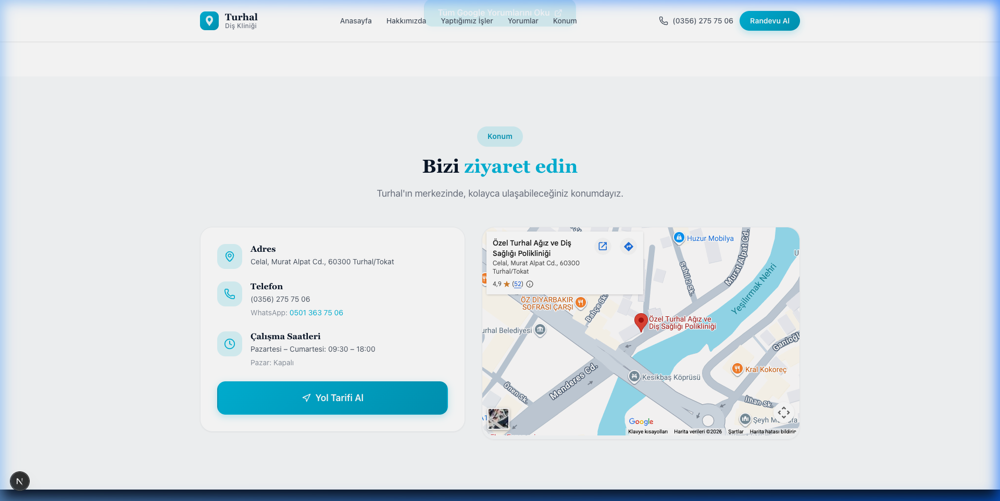

# 🦷 Özel Turhal Ağız ve Diş Sağlığı Polikliniği (V2)

<p align="center">
  
</p>

<p align="center">
  
  
  
  
  
</p>

---

## 📌 Proje Hakkında

**Özel Turhal Ağız ve Diş Sağlığı Polikliniği V2**, modern sağlık teknolojileri ve kullanıcı dostu arayüz tasarımı ilkeleriyle geliştirilmiş kapsamlı bir klinik web platformudur. 

Ziyaretçilerin hekim seçimi yapabilmesi, canlı takvim üzerinden müsait randevu saatlerini anlık olarak belirlemesi ve **Doktorsitesi.com** ile entegre çift yönlü randevu senkronizasyonu sunan yeni nesil bir sağlık portalıdır.

---

## ✨ Öne Çıkan Özellikler

### 1. 📅 Gerçek Zamanlı Online Randevu Sistemi
* **Hekim Bazlı Randevu Seçimi:** Ziyaretçiler kliniğimiz hekimleri arasından seçim yapabilir ve hekime özel takvimi görüntüleyebilir.
* **⚡ Doktorsitesi.com Canlı Takvim Senkronizasyonu:** Dt. Yakup Aşar'ın Doktorsitesi takvimi ile 30 dakikada bir otomatik senkronize olan ve anlık kontenjan boşalmalarını anında yakalayan optimize edilmiş API mimarisi.
* **🕒 Akıllı Saat Yönetimi:** Bugün için saati geçmiş randevu aralıkları otomatik filtrelenir ve kullanıcıların geçmiş zamana rezervasyon yapması engellenir.
* **🔍 Aranabilir Çoklu Hizmet Seçimi:** İmplant, Zirkonyum, Diş Beyazlatma, Kanal Tedavisi gibi tedavi türlerini arayarak birden fazla seçim yapabilme.
* **💬 WhatsApp Teyit & KVKK Entegrasyonu:** Randevu başarıyla tamamlandığında tek dokunuşla WhatsApp üzerinden kliniğe teyit mesajı iletebilme.

### 2. 🌟 Hasta Yorumları & Google Deneyimi
* Google Review derecelendirmeleri, filtreleme sekmeleri (Tümü, Diş Beyazlatma, İmplant vb.) ve `/yorumlar` detay sayfası.
* Güven tescilleyen hasta puanlama rozetleri ve dinamik yıldız bileşeni.

### 3. 🎨 Modern & Erişilebilir Tasarım (Design System)
* Açık mavi (`#5f91d3`) ve klinik nane/turkuaz tonlarına sahip ferah renk paleti.
* Sayfa kaydırma ile devreye giren dinamik şeffaf / buzlu cam (frosted glass) Navbar.
* Mobil cihazlara özel sabit eylem çubuğu (**Hemen Ara** ve **WhatsApp Randevu**).

---

## 📸 Arayüz Vitrini

<div align="center">
  <table>
    <tr>
      <td width="50%">
        
        <p align="center"><b>Modern Anasayfa ve Karşılama Alanı</b></p>
      </td>
      <td width="50%">
        
        <p align="center"><b>Uzman Kadro ve Hasta Değerlendirmeleri</b></p>
      </td>
    </tr>
    <tr>
      <td width="50%">
        
        <p align="center"><b>Klinik ve Tedavi Galerisi</b></p>
      </td>
      <td width="50%">
        
        <p align="center"><b>Google Harita & Çalışma Saatleri</b></p>
      </td>
    </tr>
  </table>
</div>

---

## 🛠️ Teknoloji Yığını

* **Framework:** [Next.js 16 (App Router)](https://nextjs.org/)
* **Kütüphane:** [React 19](https://react.dev/)
* **Derleme Aracı:** Next.js Turbopack
* **Stil & Tasarım:** CSS Modules, Modern CSS Custom Properties (Design Tokens)
* **İkonlar:** [Lucide React](https://lucide.dev/)
* **Entegrasyonlar:** Doktorsitesi.com API, Google Maps Embed API, WhatsApp Business Link Generator

---

## 📁 Proje Mimarisi

```text
├── public/                 # Statik varlıklar (görseller, hekim avatarları, logolar)
├── showcase/               # Proje tanıtım ve vitrin ekran görüntüleri
├── src/
│   ├── app/
│   │   ├── api/
│   │   │   ├── appointments/      # Randevu kayıt ve sorgulama endpoint'leri
│   │   │   └── doktorsitesi/      # 30-dk canlı takvim sync servisi
│   │   ├── randevu/               # Online randevu oluşturma sihirbazı
│   │   ├── yorumlar/              # Hasta değerlendirmeleri detay sayfası
│   │   ├── globals.css            # Tipografi, renk değişkenleri ve tema
│   │   ├── layout.js              # Kök düzen ve meta veriler
│   │   └── page.js                # Ana sayfa (Landing page)
│   ├── components/
│   │   ├── Appointment/           # Takvim, saat aralıkları, servis arama modülleri
│   │   ├── Hero/                  # Karşılama alanı
│   │   ├── Navbar/                # Dinamik kontrastlı navigasyon çubuğu
│   │   ├── Footer/                # Alt bilgi ve iletişim
│   │   └── MobileActionBar/       # Mobil hızlı randevu/arama çubuğu
│   ├── config/
│   │   └── clinic.js              # Merkezi klinik bilgileri, hekimler ve hizmetler
│   └── data/                      # Statik yorumlar ve hekim veri kaynakları
```

---

## 🚀 Başlangıç ve Yerel Kurulum

Projeyi yerel ortamınızda çalıştırmak için aşağıdaki adımları takip edebilirsiniz:

### Gereksinimler
* [Node.js](https://nodejs.org/) (v18.18 veya üzeri önerilir)
* [Git](https://git-scm.com/)

### 1. Depoyu Klonlayın
```bash
git clone https://github.com/BurhanAlperen/dental_clinic.git
cd dental_clinic
```

### 2. Bağımlılıkları Yükleyin
```bash
npm install
```

### 3. Geliştirme Sunucusunu Başlatın
```bash
npm run dev
```
Tarayıcınızdan [http://localhost:3000](http://localhost:3000) adresine giderek projeyi canlı olarak görüntüleyebilirsiniz.

### 4. Üretim (Production) Derlemesi
```bash
npm run build
npm run start
```

---

## 📡 API Uç Noktaları

| Yöntem | Endpoint | Açıklama |
| :--- | :--- | :--- |
| `GET` | `/api/appointments` | Mevcut randevuları ve dolu saatleri listeler |
| `POST` | `/api/appointments` | Yeni randevu rezervasyonu oluşturur |
| `GET` | `/api/appointments/doktorsitesi` | Doktorsitesi takvimini çeker (30 dk cache) |
| `GET` | `/api/appointments/doktorsitesi?refresh=true` | Önbelleği atlayarak canlı takvimi yeniler |

---

## 📄 Lisans

Bu proje Özel Turhal Ağız ve Diş Sağlığı Polikliniği için özel olarak geliştirilmiştir. Tüm hakları saklıdır.
